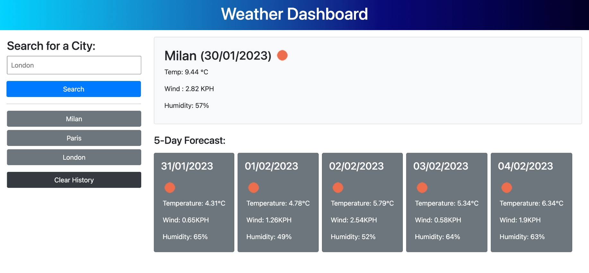

# Weather Dashboard

## Description
A simple weather dashboard that runs in the browser and features dynamically updated HTML powered by jQuery and BootStrap. The application allows a user to enter a city to see the current weather in that city as well as the 5 day forecast.

The criteria for this project:

1. Create a weather dashboard with form input
2. When a user searches for a city they are presented with current and future conditions for that city and that city is added to the search history
3. When the user views the current weather conditions for that city they are presented with the city name, date, an icon representing the weather condition, the temperature, humidity and wind speed
4. When a user views future weather conditions for that city they are presented with a 5-day forecast that displays the date, an icon representing the weather condition, the temperature, wind speed and humidity
5. When a user clicks on a city in the search history they are again presented with current and future conditions for that city.

To visit the website, [please click this link.](https://bethanyryalls.github.io/weather-dashboard/)

## Table of Contents
- [Description](#description)
- [Installation/Usage](#installationusage)
- [Design Decisions](#design-decisions)
- [Resources](#resources)
- [License](#license)

## Installation/Usage

### Screenshot
The following screenshot shows the application in full.
    

### Users
To visit the website, [please click this link.](https://bethanyryalls.github.io/weather-dashboard/)

You will be directed to the webpage where you can enter a city name, you will then be shown the current and future weather conditions for that city. The city name will be stored and you can click on previous searches to bring up that city's weather conditions.

### Developers
1. Navigate to the main page of the repository
2. Click the green 'Code' button and copy the SSH or HTTPS key
3. In terminal (Mac) or Git Bash (Windows) clone into the directory you want the repo in using the 'git clone' command followed by pasting your SSH or HTTPS key
4. Open the directory in your code editor
5. Inspect the html and js files to see how the application works!

## Design Decisions
- I have included functionality to only show the last 6 search terms, so that the search buttons do not continue down the page.

- I also included a 'Clear History' button so that the user could clear their search history as well as the local storage.

- I used Bootstrap classes throughout and did not include css files, the application is reponsive and should have very similar styling on most devices.

## Resources
- [Stack Overflow](https://stackoverflow.com)
- [Moment.js Docs](https://momentjs.com/docs/)
- [jQuery Docs](https://api.jquery.com/)
- [OpenWeather API Docs](https://openweathermap.org/forecast5)

## License

